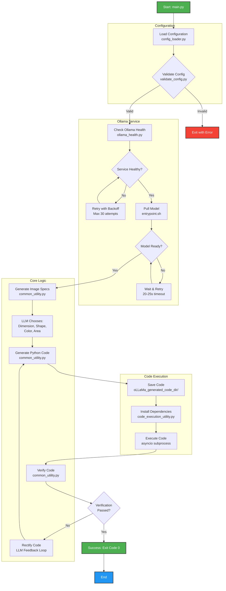

# 🦙 Ollama Adaptive Image Code Gen 🧠

> **Fun Fact:** LLMs can sometimes "hallucinate" information, which means they might generate details that sound plausible but are made up. It's like when someone tells a creative but fictional story and you're unsure if they're joking or serious!

---

## Abstract

**Ollama Adaptive Image Code Gen** is an asynchronous Python application that leverages LLMs to autonomously generate, execute, and verify Python code for creating images. The system intelligently chooses image specifications (dimension, shape, color, area), generates drawing code, installs dependencies dynamically, executes the code, and verifies the output against specifications through an iterative refinement loop.

---

## Project Architecture

### Technical Flow Diagram (TFD)



---

## File Architecture

### Root Directory Structure

```
Ollama-Adaptive-Image-Code-Gen/
├── main.py                          # Application entry point: Async orchestration of LLM workflow
├── validate_config.py               # Pre-build validation: Checks config.json structure and values
├── pre_build_check.sh               # Shell script: Comprehensive pre-Docker-build validation
├── requirements.txt                 # Python dependencies: aiohttp, ollama, requests with pinned versions
├── docker-compose.yaml              # Container orchestration: Ollama service with volumes and health checks
├── Dockerfile                       # Container image: Ollama base with custom entrypoint
├── entrypoint.sh                    # Container startup: Server init, model pulling, readiness checks
├── README.md                        # Documentation: Setup guide and project overview
├── LICENSE                          # License file: MIT License
├── .gitignore                       # Git ignore rules: Excludes venv, logs, generated code
├── .dockerignore                    # Docker ignore rules: Excludes unnecessary files from build
│
├── config/
│   ├── config.json                  # Application config: Ollama settings, timeouts, execution limits
│   └── prompt_config.json           # Prompt templates: LLM instructions for code generation
│
├── utility/
│   ├── version.py                   # Version management: Centralized version number
│   ├── config_loader.py             # Configuration loader: JSON parsing with environment overrides
│   ├── ollama_health.py             # Health checker: Ollama service availability validation
│   ├── common_utility.py            # Core logic: LLM interaction, prompt handling, code verification
│   └── code_execution_utility.py    # Code executor: Dynamic dependency installation and execution
│
├── oLLaMa_generated_code_dir/       # Generated code output: Python files created by LLM
│   └── generated_code.py            # Generated image code: Dynamic Python drawing code
│
├── logs/                            # Application logs: Runtime logs and debugging information
│   └── app.log                      # Log file: Execution traces and errors
│
├── media/                           # Media assets: Project diagrams and workflow images
│   └── OLLaMa_Image_Adaptive_Code_Gen_WorkFlow.png  # Workflow diagram
│
└── circle_with_color.png            # Sample output: Example generated image
```

---

## Pre-Steps: Before Starting the Project

### 1. Validate Configuration Files

Before building or running the project, validate your configuration files using the provided scripts.

#### Using validate_config.py (Python Validation)

This script checks if `config.json` exists, is valid JSON, and contains all required sections.

**For macOS and Linux:**
```bash
python3 validate_config.py
```

**For Windows:**
```bash
python validate_config.py
```

**Expected Output:**
```
Validating configuration: /path/to/config/config.json

======================================================================
 Configuration Validation Report
======================================================================
 Config File: /path/to/config/config.json
 App Version: 1.0.0
----------------------------------------------------------------------

======================================================================
✓ VALIDATION PASSED - Configuration is valid
======================================================================

✓ Ready for Docker build and deployment!
```

#### Using pre_build_check.sh (Comprehensive Validation)

This shell script performs all necessary validations before Docker build to avoid failed builds.

**For macOS and Linux:**

```bash
# Step 1: Make script executable (first time only)
chmod +x pre_build_check.sh

# Step 2: Run validation
./pre_build_check.sh
```

**For Windows:**

Windows users can use Git Bash or WSL (Windows Subsystem for Linux):

```bash
# Using Git Bash
chmod +x pre_build_check.sh
./pre_build_check.sh

# Using WSL
wsl chmod +x pre_build_check.sh
wsl ./pre_build_check.sh
```

**What the Script Validates:**
- ✓ Python syntax in all files (main.py, utility modules)
- ✓ JSON validity in config files (config.json, prompt_config.json)
- ✓ Version consistency between config and application
- ✓ Dockerfile configuration (base image, WORKDIR, ENTRYPOINT)
- ✓ docker-compose.yaml configuration (volumes, healthcheck, environment)
- ✓ requirements.txt pinned versions (ollama, aiohttp, requests)

**Expected Output:**
```
================================================================================
  Ollama Adaptive Image Code Gen - Pre-Build Validation
================================================================================

[1/6] Checking Python syntax...
✓ main.py syntax OK
✓ utility/config_loader.py syntax OK
✓ utility/common_utility.py syntax OK
✓ utility/code_execution_utility.py syntax OK
✓ utility/ollama_health.py syntax OK
✓ utility/version.py syntax OK

[2/6] Validating configuration files...
✓ config/config.json is valid JSON
✓ config/prompt_config.json is valid JSON

[3/6] Checking version consistency...
✓ Version consistency: 1.0.0

[4/6] Checking Dockerfile...
✓ Dockerfile uses ollama/ollama:latest
✓ Dockerfile sets WORKDIR /app
✓ Dockerfile has ENTRYPOINT

[5/6] Checking docker-compose.yaml...
✓ docker-compose.yaml has volume mounts
✓ docker-compose.yaml has healthcheck
✓ docker-compose.yaml has environment variables

[6/6] Checking requirements.txt...
✓ requirements.txt has pinned ollama version
✓ requirements.txt has pinned aiohttp version
✓ requirements.txt has pinned requests version

================================================================================
  Validation Summary
================================================================================
  Errors:   0
  Warnings: 0
================================================================================
✓ VALIDATION PASSED - All checks successful!

Ready to build! Next steps:
  1. docker compose build    # Build Docker image (~5-10 mins first time)
  2. docker compose up       # Start Ollama service
  3. python3 main.py         # Run application (in another terminal)
```

---

## How to Start the Project

### Prerequisites

- **Docker Desktop** installed and running
- **Python 3.8+** installed
- **Git** (for cloning the repository)

#### Install Docker Desktop

**For macOS:**
Download from [Docker Desktop for Mac](https://docs.docker.com/desktop/install/mac-install/)

**For Windows:**
Download from [Docker Desktop for Windows](https://docs.docker.com/desktop/install/windows-install/)

**For Linux:**
Download from [Docker Desktop for Linux](https://docs.docker.com/desktop/install/linux-install/)

---

### Step 1: Build Docker Image (15-25 minutes first time)

**For macOS and Linux:**
```bash
docker compose build
```

**For Windows (PowerShell or Command Prompt):**
```bash
docker compose build
```

**What Happens:**
- Downloads Ollama base image
- Installs curl for health checks
- Copies application code to `/app`
- Sets up entrypoint script

---

### Step 2: Start Ollama Service

**For macOS and Linux:**
```bash
docker compose up -d
```

**For Windows:**
```bash
docker compose up -d
```

**Monitor Logs:**
```bash
docker compose logs -f ollama
```

**Wait for This Message:**
```
Ollama server and model 'qwen2.5:0.5b' are ready
```

**Note:** First-time startup takes 20-25 minutes as it downloads the model (~4.7GB).

---

### Step 3: Run the Application

**Note:** You can run the application either directly with Python or within a virtual environment. Using a virtual environment is recommended for dependency isolation. See the [How to Run Using Virtual Environment](#how-to-run-using-virtual-environment) section for detailed instructions.

**For macOS and Linux:**
```bash
# Option 1: Direct execution (dependencies must be installed globally)
python3 main.py

# Option 2: Using virtual environment (recommended)
# See: #how-to-run-using-virtual-environment
```

**For Windows:**
```bash
# Option 1: Direct execution (dependencies must be installed globally)
python main.py

# Option 2: Using virtual environment (recommended)
# See: #how-to-run-using-virtual-environment
```

**Expected Output:**
```
==========================================================================================
  Ollama Adaptive Image Code Gen v1.0.0
==========================================================================================

  Application Description:
  ------------------------
  This application uses Ollama LLM to:
    1. Choose image specifications (dimension, shape, color, area)
    2. Generate Python code for drawing the image
    3. Execute code with automatic dependency installation
    4. Verify generated code against specifications
    5. Iteratively rectify code if verification fails

  Configuration Summary:
  ----------------------
  Ollama Settings:
    • Host:              localhost
    • Port:              11434
    • Model:             qwen2.5:0.5b
    • Health Retries:    30 attempts
    • Health Interval:   5s
    • Model Wait Time:   20s

[Step 1/3] Checking Ollama service health...
[OK] Ollama service is healthy

[Step 2/3] Pulling model instance...
[OK] Model 'qwen2.5:0.5b' is ready

[Step 3/3] Generating and verifying code...
[OK] Application completed successfully - Code generated and verified!
```

---

### Step 4: Check Generated Output

**View Generated Code:**

**For macOS and Linux:**
```bash
cat oLLaMa_generated_code_dir/generated_code.py
```

**For Windows:**
```bash
type oLLaMa_generated_code_dir\generated_code.py
```

**View Application Logs:**

**For macOS and Linux:**
```bash
cat logs/app.log
```

**For Windows:**
```bash
type logs\app.log
```

**List Generated Images:**

**For macOS and Linux:**
```bash
ls -la oLLaMa_generated_code_dir/
```

**For Windows:**
```bash
dir oLLaMa_generated_code_dir\
```

---

## How to Run Using Virtual Environment

### Create and Activate Virtual Environment

#### For macOS and Linux

```bash
# Step 1: Create virtual environment
python3 -m venv venv

# Step 2: Activate virtual environment
source venv/bin/activate

# Step 3: Install dependencies
pip3 install -r requirements.txt

# Step 4: Run application
python3 main.py

# Step 5: Deactivate virtual environment (after execution completes)
deactivate
```

#### For Windows

**Using Command Prompt:**
```bash
# Step 1: Create virtual environment
python -m venv venv

# Step 2: Activate virtual environment
venv\Scripts\activate.bat

# Step 3: Install dependencies
pip install -r requirements.txt

# Step 4: Run application
python main.py

# Step 5: Deactivate virtual environment (after execution completes)
deactivate
```

**Using PowerShell:**
```bash
# Step 1: Create virtual environment
python -m venv venv

# Step 2: Activate virtual environment
venv\Scripts\Activate.ps1

# Step 3: Install dependencies
pip install -r requirements.txt

# Step 4: Run application
python main.py

# Step 5: Deactivate virtual environment (after execution completes)
deactivate
```

**Note for PowerShell Users:** If you encounter an execution policy error, run:
```powershell
Set-ExecutionPolicy -ExecutionPolicy RemoteSigned -Scope CurrentUser
```

---

## Configuration Reference

### Customize Your LLM Model

**Want to use a different model?** You can easily switch to models that match your system requirements. Lower-end systems can use smaller models, while powerful systems can leverage larger ones for better results.

#### Quick Model Change

1. **Edit `config/config.json`:**
   ```json
   {
       "ollama": {
           "llm_model": "your-preferred-model"
       }
   }
   ```

2. **Edit `entrypoint.sh`:**
   ```bash
   OLLAMA_MODEL="${OLLAMA_MODEL:-your-preferred-model}"
   ```

3. **Rebuild and restart:**
   ```bash
   docker compose down
   docker compose build
   docker compose up -d
   ```

#### Recommended Models by System Configuration

| System RAM | Recommended Model | Model Size | Performance |
|------------|-------------------|------------|-------------|
| 4-8 GB     | qwen2.5:0.5b      | ~0.5 GB    | Fast        |
| 8-16 GB    | llama3.2:1b       | ~1.3 GB    | Balanced    |
| 16-32 GB   | llama3.1:8b       | ~4.7 GB    | Excellent   |
| 32+ GB     | llama3.1:70b      | ~40 GB     | Best        |

#### Popular Ollama Models

- **qwen2.5:0.5b** - Lightweight, fast inference
- **llama3.2:1b** - Balanced performance and quality
- **llama3.1:8b** - High quality code generation
- **llama3.1:70b** - Best quality, requires significant resources
- **mistral:7b** - Good general-purpose model
- **codellama:7b** - Specialized for code generation

---

### config.json Settings Reference

| Setting | Default | Description |
|---------|---------|-------------|
| `ollama.host` | localhost | Ollama server host address |
| `ollama.port` | 11434 | Ollama server port number |
| `ollama.llm_model` | qwen2.5:0.5b | LLM model to use for generation |
| `ollama.model_specs.role` | user | Role for LLM prompts |
| `ollama.model_specs.stream_flag` | true | Enable streaming responses |
| `ollama.timeouts.health_check` | 10 | Health check timeout in seconds |
| `ollama.timeouts.chat_request` | 60 | Chat API timeout in seconds |
| `ollama.timeouts.generate_request` | 120 | Generate API timeout in seconds |
| `ollama.timeouts.model_readiness_wait` | 20 | Wait time for model readiness in seconds |
| `ollama.retries.health_check_max` | 30 | Maximum health check retry attempts |
| `ollama.retries.health_check_interval` | 5 | Seconds between health check retries |
| `ollama.retries.llm_call_max` | 3 | Maximum LLM call retry attempts |
| `ollama.retries.verification_max_attempts` | 3 | Maximum code verification attempts |
| `generated_code_config.dir_path` | oLLaMa_generated_code_dir | Directory for generated code |
| `generated_code_config.file_path` | generated_code.py | Filename for generated code |
| `execution.timeout_seconds` | 30 | Code execution timeout in seconds |
| `execution.memory_limit_mb` | 512 | Memory limit for execution in MB |
| `execution.allowed_modules` | ["matplotlib", "PIL", "numpy", "cv2"] | Allowed Python modules |
| `logging.level` | INFO | Log level (DEBUG/INFO/WARNING/ERROR) |
| `logging.format` | %(asctime)s - ... | Log message format |
| `logging.file` | logs/app.log | Log file path |

---

### Environment Variables (Optional)

Override `config.json` values using environment variables:

```bash
export OLLAMA_HOST=localhost
export OLLAMA_PORT=11434
export OLLAMA_MODEL=qwen2.5:0.5b
export OLLAMA_HEALTH_CHECK_MAX_RETRIES=30
export OLLAMA_HEALTH_CHECK_INTERVAL=5
export OLLAMA_MODEL_READINESS_WAIT=20
```

---

### prompt_config.json Settings

| Setting | Description |
|---------|-------------|
| `context` | System context for LLM as a Python developer |
| `system_instructions.code_format` | Expected code format (python) |
| `system_instructions.must_include_imports` | Require imports in generated code |
| `system_instructions.must_save_image` | Require image saving in generated code |
| `system_instructions.forbidden_patterns` | Disallowed code patterns (input, exec, eval) |
| `system_instructions.required_patterns` | Required code patterns (import, plt.show, etc.) |
| `prompts.dimension` | Prompt for choosing 2D or 3D |
| `prompts.shape` | Prompt for choosing geometric shape |
| `prompts.color` | Prompt for choosing color |
| `prompts.area` | Prompt for choosing inside/outside fill |
| `verification.prompt_template` | Template for code verification prompt |
| `verification.rectification_template` | Template for code rectification prompt |
| `code_generation.initial_prompt_template` | Template for initial code generation |
| `code_generation.examples` | Example code snippets for shapes |

---

## How to Contribute to the Project

### 1. Find an Issue

Browse open issues on the [GitHub Issues page](https://github.com/jaypatel15406/Ollama-Adaptive-Image-Code-Gen/issues).

### 2. Claim an Issue

Comment on the issue with: **"Can I work on this?"** and start exploring it.

### 3. Fork and Clone

```bash
# Fork the repository on GitHub, then clone your fork
git clone https://github.com/YOUR_USERNAME/Ollama-Adaptive-Image-Code-Gen.git
cd Ollama-Adaptive-Image-Code-Gen
```

### 4. Create a Branch

```bash
# Create a new branch for your feature/fix
git checkout -b feature/issue-123-short-description
```

### 5. Make Changes

- Follow the code writing standards from the [AI/LLM Agent Guide](agents/ai-llm-agent.md)
- Add tests for new functionality
- Update documentation if needed
- Run pre-build validation before committing

```bash
# Run validation
./pre_build_check.sh

# Run tests (if applicable)
python3 -m pytest
```

### 6. Commit Changes

```bash
# Stage your changes
git add .

# Commit with clear message
git commit -m "Fixes #123: Brief description of the change"
```

### 7. Push and Create Pull Request

```bash
# Push to your fork
git push origin feature/issue-123-short-description
```

Create a Pull Request on GitHub with the title format:
```
Fixes #IssueNo: Name of the Issue
```

### Pull Request Guidelines

- **Title Format:** `Fixes #IssueNo: Name of the Issue`
- **Description:** Clearly explain what your changes do
- **Tests:** Include tests for new functionality
- **Documentation:** Update README or other docs if needed
- **Code Style:** Follow PEP 8 and project conventions

**Important:** Invalid PRs will be closed. Follow the guide at [Creating a Pull Request](https://help.github.com/articles/creating-a-pull-request/).

### For Any Questions

Comment on the respective issue with your queries. The maintainers will help you understand the issue better.

---

## Future Work Enhancements

1. **LLaVa Integration:** Add a new layer of image verification by integrating the **LLaVa** LLM model. This model can verify the image with respect to its contexts and prompts, which will enhance the accuracy of the current workflow.

2. **Multiple Shapes and Colors:** After achieving satisfactory accuracy, integrate support for multiple shapes and multiple colors plotting in a single generated image.

---

## License

This project is licensed under the MIT License - see the [LICENSE](LICENSE) file for details.
